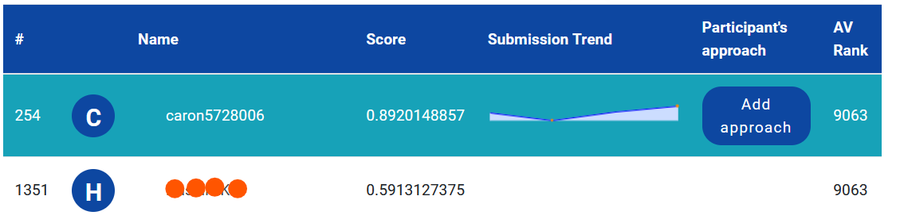

## My solution to solve a practice NLP classification challenge on Analytics Vidhya's website - [Identify the Sentiments](https://datahack.analyticsvidhya.com/contest/linguipedia-codefest-natural-language-processing-1/). Here is where I stand with few hours of hacking - position 254 out of 1394.

## Problem statement -

Sentiment analysis remains one of the key problems that has seen extensive application of natural language processing. This time around, given the tweets from customers about various tech firms who manufacture and sell mobiles, computers, laptops, etc, the task is to identify if the tweets have a negative sentiment towards such companies or products.

## The Data Set

- The train set contains 7,920 tweets 
- The test set contains 1,953 tweets

## Data Pre-processing

   - Lower-case all characters
   - Remove twitter handles
   - Remove urls
   - Removed punctuations
   - Removed stopwords
   
## Approach

My approach was simple, to try out as many models as possible, before trying to tweak or tune hyperparameters.

Models I used in this project:
- Logistic Regression
- Support Vector Classifier
- Random Forest Classifier
- K Nearest Neighbors
- Naive Bayes
- Voting Classifier
- Stacking Classifier
- Ridge Classifier
- Bagging Classifier
- Gradient Boosting Classifier

## Side Note
We were free to use any tool, statistical software or machine of our choice, but a comprehensive guide to use the bert-base-uncased and the roberta-base pre-trained transformer models were given. As this was my first attempt, I did not use these pre-trained models.

## Result

    My Rank: 254
    Unique Submissions: 1394
    Registered Contestants: 8162
    Date: 22/12/2022

